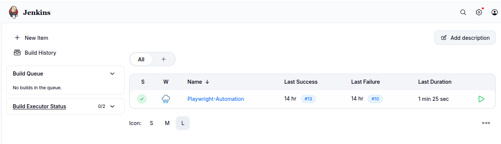
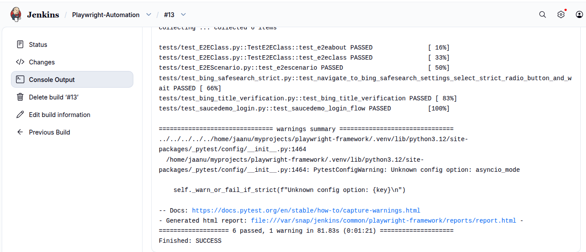
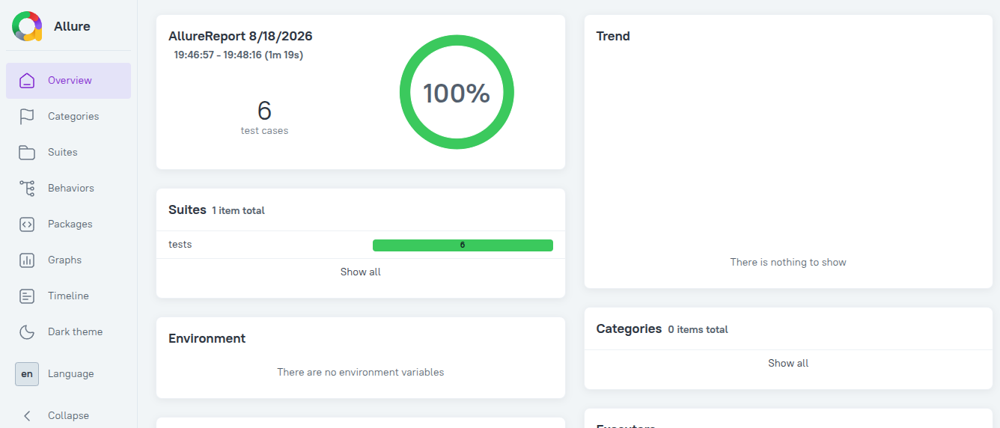
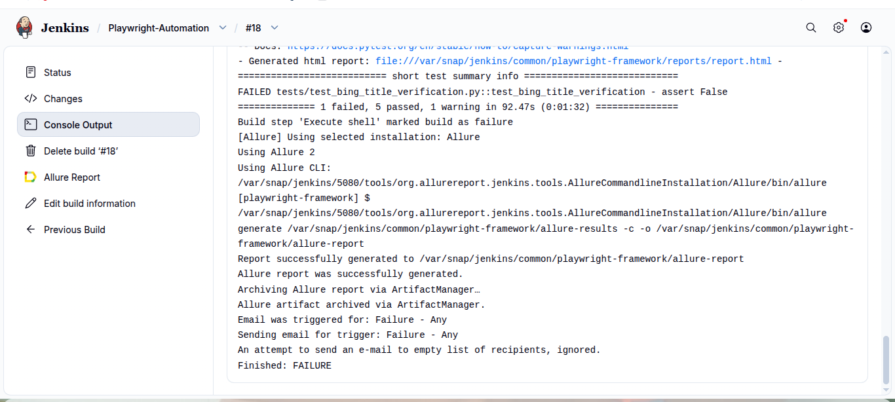
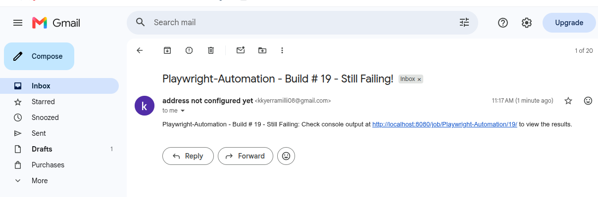

# Jenkins Playwright Test Automation

Jenkins automation project demonstrating CI-based execution of Playwright end-to-end tests using Pytest, Allure reporting, build result handling, and email notifications.

## Project Overview

This project demonstrates the execution of a Playwright and Pytest automation test suite through Jenkins.

The Playwright automation framework is maintained separately in the `playwright-framework` project.

The Jenkins project provides evidence of automated test execution, successful and failed builds, Allure reporting, and email notification handling.

## Jenkins Job

The Jenkins job is configured as:

`Playwright-Automation`



The Jenkins dashboard shows the automation job and its build history.

## Automated Test Execution

The Jenkins build executes the Playwright and Pytest test suite.



The successful Jenkins execution completed with:

- 6 tests passed
- 0 test failures
- Jenkins build completed successfully
- SauceDemo E2E testing included in the execution

The executed test suite includes:

- `test_E2EClass.py`
- `test_E2EScenario.py`
- `test_bing_safesearch_strict.py`
- `test_bing_title_verification.py`
- `test_saucedemo_login.py`
- Additional configured test scenario

## Allure Test Reporting

Allure provides a visual report of the automated test execution.



The Allure Jenkins integration can publish generated Allure results and make the report available from Jenkins.

## Failure Handling

A separate Jenkins execution demonstrates handling of an automated test failure.



The failed execution provides evidence of Jenkins detecting a test failure and marking the build accordingly.

This demonstrates both successful and unsuccessful automation execution through Jenkins.

## Email Notification

Jenkins was configured to send email notifications for build results.



The notification provides build status information when an execution encounters a test failure.

## Jenkins Test Execution Process

1. Jenkins starts the configured automation job.
2. The Playwright test suite is executed using Pytest.
3. Test execution results are collected.
4. The Jenkins build result is recorded.
5. Allure results are generated and published.
6. Email notification is generated for the configured build result.

Jenkins supports recording automated test results and artifacts generated during builds.

## Technology Used

- Jenkins
- Python
- Pytest
- Playwright
- Allure
- Git
- GitHub

## Project Structure

```text
jenkins-playwright-automation/
├── screenshots/
│   ├── jenkins-playwright-automation.png
│   ├── jenkins-E2E-test-passed.png
│   ├── allure-report.png
│   ├── failed-console-output.png
│   └── failure-email-alert.png
└── README.md
```

The Playwright automation source code remains maintained separately in the `playwright-framework` repository.

## Project Outcome

This project demonstrates practical Jenkins-based CI execution of Playwright and Pytest automation, including:

- Automated browser test execution
- SauceDemo end-to-end testing
- Successful build validation
- Failed test detection
- Allure reporting
- Build failure notification

The project provides documented evidence of integrating automated Playwright testing with Jenkins CI execution.
